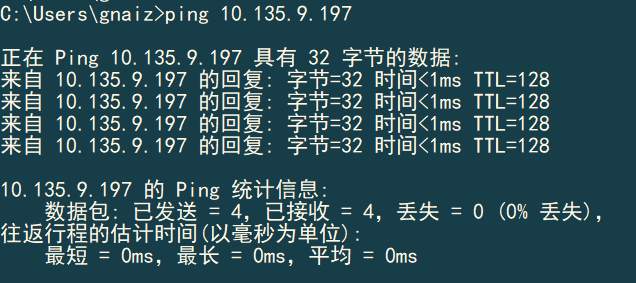
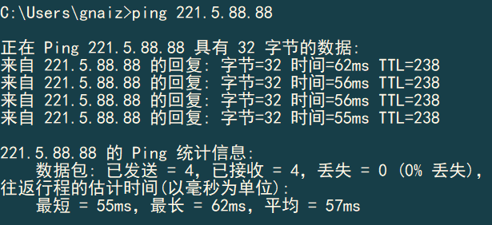
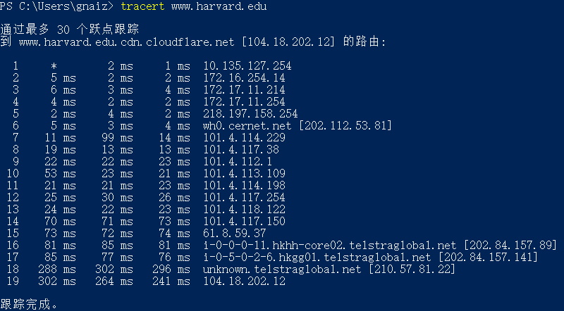

# HomeWork_1 #

## ping另外一台计算机 ##

## tracert 一个服务器 ##

## 课本第一章习题任意选做3道 ##

### P6 ###

a. $d_{prop} = m/s$

b. $d_{trans} = L/R$

c. $d = d_{prop} + d_{trans} = m/s + L/R$

d. 刚刚离开主机A

e. 正在链路上传播

f. 已经到达主机B

g. 
$$
\frac{L}{R} = \frac{120}{56000} = \frac{m}{s} = \frac{m}{2.5*10^8}\\
m = \frac{120*2.5*10^8}{5.6*10^4}=536*10^3m = 536km
$$

### P8 ###

### P10 ###

$$
d = 2d_{proc}+\frac{L}{R_1}+\frac{L}{R_2}+\frac{L}{R_3}+\frac{d_1}{s_1}+\frac{d_2}{s_2}+\frac{d_3}{s_3}\\
d = 2*3ms + 3*\frac{1500*8}{2*10^6}*10^3ms+\frac{(5000+4000+1000)*10^3}{2.5*10^8}*10^3ms\\
=6+18+40=64ms
$$

