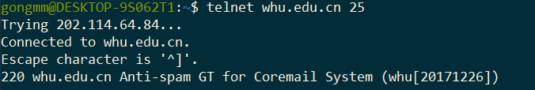

# Homework_2 #

> 2016302580099 王子昂

## Telnet ##

## 任选五题 ##

### P1 ###

1. F. 一个请求报文对应一个响应报文
2. T. 请求的内容来自同一个服务器主机，存放在同一个服务器中的多个Web页面可以通过单个持久TCP连接发送
3. F. 非持续连接只能携带一个Http服务请求报文
4. F. Date为服务器产生并发送该响应报文的日期和时间
5. F. 存在空的报文体

### P4 ###

1. http://gaia.cs.umass.edu/cs453/index.html  由主机名和GET后的地址得到
2. 运行的HTTP协议是1.1版本。由HTTP/1.1得到
3. 采用的是持续连接。由Connection: keep-alive得到
4. 主机的IP地址并没有包括在HTTP报文中，所以无法得到
5. Mozilla/5.0。由User-Agent得到，服务器可以有效的为不同类型的用户代理实际发送相同对象的不同版本

### P5 ###

1. 能成功找到，因为返回的状态码是200。提供回答的时间是Tuesday, 07 Mar 2008 12:39:45 GMT 由Date得到
2. 最后修改时间为 Saturday 10 Dec 2005 18:27:46 GMT 由Last-Modified得到
3. 返回3874字节。由Content-Length得到
4. 前五个字节为`<!doc`。服务器同意持续连接，由Connection: Keep-Alive 得到

### P7 ###

得到IP地址所需的时间为：
$$
RTT_1+RTT_2+..+RTT_n
$$
点击超链接到接收到对象的时间为：得到IP地址的时间 + 建立TCP连接的时间 + 请求和接受文件的时间（接受文件的使劲按忽略不计）
$$
RTT_1+RTT_2+..+RTT_n+2RTT_0
$$

### P8 ###

1. 串行非持续HTTP连接，每次请求都需要重新建立TCP连接，需要额外的$2RTT_0$
   $$
   2RTT_0+8*2RTT_0+RTT_1+RTT_2+..+RTT_n\\
   =18RTT_0+RTT_1+RTT_2+..+RTT_n
   $$

2. 8个请求对象每5个并行，相当于需要花费两次建立TCP连接的时间，再加上请求HTML文件所需的时间
   $$
   2RTT_0+2*2RTT_0+RTT_1+RTT_2+..+RTT_n\\
   =6RTT_0+RTT_1+RTT_2+..+RTT_n
   $$

3. 不支持流水线，客户只在收到前一个请求的响应后才发出新的请求，这种情况下，Web页面所引用的每个对象（上例中的10个图像）都经历1个RTT的延迟，用于请求和接收该对象
   $$
   2RTT_0+8*RTT_0+RTT_1+RTT_2+..+RTT_n\\
   =10RTT_0+RTT_1+RTT_2+..+RTT_n
   $$
   

   若支持流水线，客户不需要得到前一个响应就可以发出新的请求，只需要经历1个RTT的延迟
   $$
   2RTT_0+RTT_0+RTT_1+RTT_2+..+RTT_n\\
   =3RTT_0+RTT_1+RTT_2+..+RTT_n
   $$
   