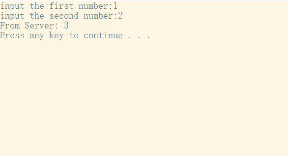

# Homework_3 #

## 任选五题 ##

### P3 ###

0 1 0 1 0 0 1 1 + 0 1 1 0 0 1 1 0 = 1 0 1 1 1 0 0 1 (没有出现溢出，无需回卷)

1 0 1 1 1 0 0 1 + 0 1 1 1 0 1 0 0 = 0 0 1 0 1 1 1 0 (发生溢出，进行回卷)

0 0 1 0 1 1 1 0 的补码为 1 1 0 1 0 0 0 1 

1. 使用反码因为在接收方检验错误时，将接收到的三个字节与检验和直接相加。如果没有错误，使用反码可以得到各位全为1的结果，如果某一位出现0，则说明在传输的过程中出现了错误。使用反码方便进行判断，同时，使用反码求和不依赖系统是大端小端。即无论你是发送方计算机或者接收方检查校验和时，直接相加就可以得到正确的结果
2. 检验差错的方法：将接收到的三个字节与检验和直接相加。若得到的结果各位全为1，说明没有错误；如果某一位出现0，则说明在传输的过程中出现了错误
3. 1比特错误一定可以检验出来
4. 2比特的错误有可能检验不出来如果由两个字节在同一位上同时发生了错误，那么检验和还为1，无法检验出错误

### P6 ###

假设此时发送方处于等待来自上层调用1的状态，接收方处于等待来自下层的1的状态。这时，发送方发送了一个序号为1的分组，然后跳转到状态等待ACK，接收方正确接收到序号为1的分组，发送ACK然后跳转到状态等待来自下层的0。但是，如果这个ACK在传输的过程中受损，发送方收到一个破损的包，会重发序号为1的分组，但此时接收方在等待一个序号为0的分组到达，所以会发送NAK，系统会陷入死锁，发送方一直发送序号为1的分组，接收方一直发送NAK

### P15 ###

将要发送的一个分组送进信道所需要的时间为：$\frac{1500*8}{10^9}=0.012s$

要使信道的利用率达到98%，设窗口长度为n，那么
$$
\frac{0.012n}{30+0.012}=0.98\\
n = \frac{0.98*30.012}{0.012}=2450.98
$$
窗口长度应为2451

### P40 ###

a. [1, 6]、[23, 26]

b. [6, 16]、[17, 22]

c. 三个冗余。因为窗口长度减半

d. 超时。因为窗口长度减小到1

e. 32。由图可知，此时慢启动停止，转为拥塞避免

f. 42/2 = 21 由于发生了3个冗余的ACK，因此ssthresh 为此时的窗口长度减半

g. 29/2 = 14 由于发生了超时，因此ssthresh 为此时的窗口长度减半

h. 在第7个传输轮回中。在慢启动状态一共传递了 1+2+4+8+16+32 = 63个报文，在第七个传输轮回中传递了33个报文，其中就包含第70个报文段

i. 窗口长度为此时窗口长度减半再加3 = 8/2+3 = 7；ssthresh为窗口长度减半 = 8/2 = 4

j.使用Tahoe，遇到3个冗余ACK和超时都会使窗口长度减小到1，ssthresh减半然后进入慢启动状态。因此，ssthresh = 42/2 = 21；窗口长度= 1

k. 由于第17个轮回中发生ACK冗余，因此窗口长度减小到1，然后进行慢启动，在第22个轮回中超过阈值进入拥塞避免但又发生了超时回到慢启动，发送的分组为 1 + 2 + 4 + 8 + 16 + 21 = 52

### P46 ###

a. 设最大窗口长度为W $\frac{1500*8*W}{RTT} = \frac{12000W}{0.15} = 10Mbps$ 解得 $W = 125$

b. 平均窗口长度： (W/2+W)/2 = 0.75W  = 125 * 0.75 = 94 

​      平均吞吐量：$\frac{0.75W*1500*8}{0.15} = 0.75*10Mbps = 7.5Mbps$

c. 由于忽略慢启动状态，所以考虑窗口长度会减半，进入拥塞避免阶段，窗口长度每个轮回中+1，恢复到最大窗口需要的轮回数位 W/2 = 125/2 = 63 需要的时间为 63*0.15 = 9.45s

## Python TCP 程序 ##

> 一个简易的加法计算器，客户端输入要相加的两个数字，服务器端得到后进行计算然后返回结果

### Client TCP ###

```python
from socket import *

serverName = 'localhost'
serverPort = 12000
clientSocket = socket(AF_INET, SOCK_STREAM)
clientSocket.connect((serverName, serverPort))

first = input("input the first number:")
second = input("input the second number:")
clientSocket.send(first.encode())
clientSocket.send(second.encode())

result = clientSocket.recv(1024)
print("From Server:", result.decode())

clientSocket.close()
```

### Server TCP  ###

```python
from socket import *

serverPort = 12000
serverSocket = socket(AF_INET, SOCK_STREAM)
serverSocket.bind(('localhost', serverPort))
serverSocket.listen(1)

print("The server is ready to receive the number")

while True:
    connectionSocket, addr = serverSocket.accept()

    first = connectionSocket.recv(1024).decode()
    second = connectionSocket.recv(1024).decode()
    result = int(first) + int(second)
    
    connectionSocket.send(str(result).encode())

    connectionSocket.close()
```

### 结果 ###

